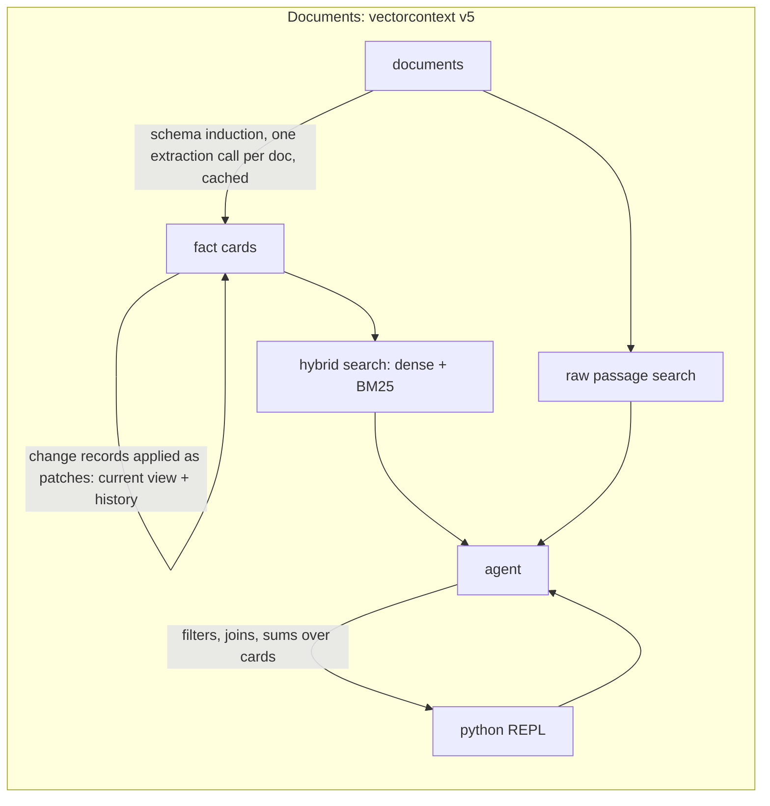
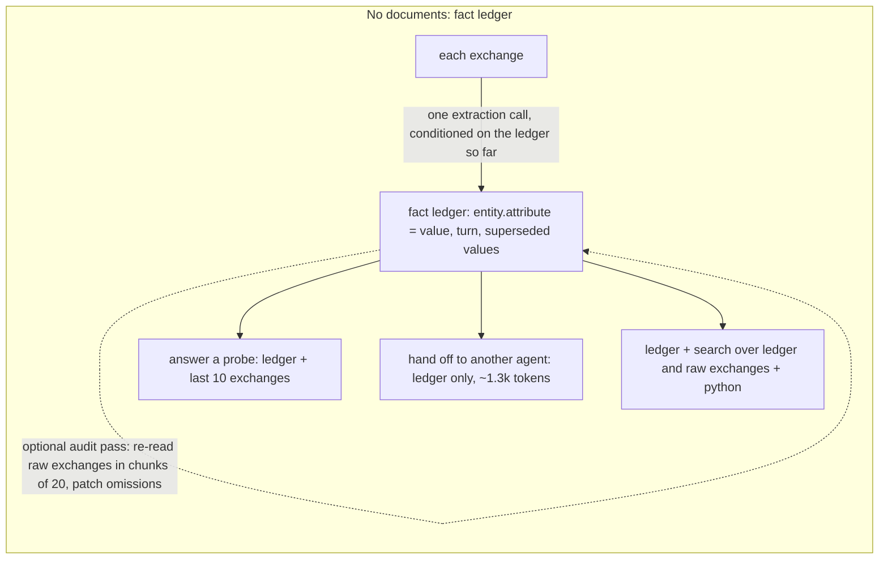

# vectorcontext lab

**Question.** Can vector retrieval replace a "REPL workspace" (corpus held in a Python variable, model greps it through a tool)
for cutting LLM context, and do it more efficiently? And does the same idea help when there are no documents at all, only a
long chat or an agent hand-off?

**Answer.** Vectors alone do not. Single-shot RAG scores 38 to 40%. The REPL scores 82 to 89% and misses paraphrase, superseded
facts and revisions. What wins on every benchmark here is a **fact layer built once at index time** (schema-first extraction
into fact cards, entity linking, typed validation, index-time supersession), searched with hybrid dense + BM25 retrieval and
aggregated in a Python REPL. It scores 100% on the hard benchmarks at about a tenth of the full-context tokens, and its cost
stays flat as the corpus grows. With no documents, the conversation is the corpus: folding each exchange into a **fact ledger**
online cuts per-question context 7 to 15x with no accuracy loss, and the ledger is the right thing to hand to another agent.
Rolling summaries look as good on spot questions but silently drop about 10% of the facts.

Everything is measured with the same model (`openai/gpt-5.6-luna` via OpenRouter) on the same questions, graded against ground
truth computed from the generator state. Raw records are in `results/`, the workbook is `results/vectorcontext_results.xlsx`,
the full write-up with every intermediate run is `docs/findings.md`. Total spend for all four parts: about $15.

## Headline results

Accuracy and prompt tokens per question. "Best" is the winning condition on that benchmark.

| benchmark | full context | REPL workspace | single-shot vector RAG | **best (this repo)** | tokens: best vs full |
|---|---|---|---|---|---|
| 45k-token corpus, 39 q (Part 1) | 95% at 46.5k | 87% at 5.0k | 38% at 0.9k | **fact cards v4: 97% at 4.7k** | 10% |
| hard corpus, 184 docs, 57 items (Part 2) | 86% at 49.3k | 82% at 5.3k | 40% at 1.5k | **v5: 100% at 5.3k** | 11% |
| hard corpus x3, 504 docs (Part 2) | 70% at 76.2k | 82% at 6.3k | not run | **v5: 100% at 6.6k** | 9% |
| long chats 29k / 72k / dense, 95 probes (Part 3) | 100 / 100 / 95% at 30k-74k | 95 / 89 / 95% at 10-13k | n/a | **fact ledger: 100% at 4-5k** | 7-15x fewer |
| agent hand-off, 195 required facts (Part 3) | 194/195 at 39.4k | n/a | n/a | **ledger: 195/195 at 1.3k** | 3% |
| messy chats, 57 probes (Part 4) | 96% at 30.8k | 91% at 11.2k | n/a | **ledger: 100% at 4.1k** | 13% |

The same v5 pipeline reached 100% on the hard corpus with two cheaper agent models (glm-5.3-flash, deepseek-v4.1-flash) at
1.4x and 2.2x the tokens. Full context degrades with the number of entities, not the number of tokens: at 504 documents it
mis-counts and mis-sums even though 71k tokens fits the window easily.

## How it works





**Documents.** At index time every document goes through one LLM extraction call against a schema induced from sample documents,
producing a fact card with consistent keys. Values are canonicalized, identifiers are linked to a canonical entity, and fields are
type-checked (a person field must hold a proper name). Change records are turned into patches so each card has a `current` view
and a `history` while its source fields stay untouched. At query time the agent searches cards (hybrid dense + BM25), opens
documents when it needs prose, and does counting, summing and joining in Python over normalized keys instead of regexes over text.
Index cost is $0.10 to $0.25 per corpus, amortized over every query.

**No documents.** As a chat happens, each exchange is folded into a ledger by one extraction call that sees the ledger so far,
so "actually make that $65k" and "same budget as ingest" are resolved while the referent is still in view. The ledger is a few
hundred lines of `entity.attribute = value` with turn numbers and superseded values, checkable field by field against ground
truth. A deterministic invariant keeps membership lists in step with add/drop flags. An optional audit pass lets a cheap folder
re-read the raw exchanges against its finished ledger and patch what it missed.

## Conditions

Document benchmarks:

| condition | mechanism |
|---|---|
| `baseline` | whole corpus in the prompt, one call |
| `repl` | corpus is a Python variable in a sandbox; the model greps/slices via a `python` tool and only sees stdout |
| `vector_rag` | classic single-shot RAG: top-8 dense chunks (contextual headers) in the prompt |
| `vectorcontext_v1` | agentic hybrid search (dense + BM25, reciprocal-rank fusion) + `open_doc`, multi-round |
| `vectorcontext_v3` | v1 + a `python` tool where `search()` is callable from code |
| `vectorcontext_v4` | fact cards: schema-first extraction per document, canonicalized and entity-linked; agent searches cards and aggregates in `python` |
| `vectorcontext_v5` | v4 + `search_text` over raw passages + guided strategy prompt + index-time supersession (`--resolve`) |

Chat and hand-off benchmarks (all keep the last 10 exchanges verbatim except `chat_full` and `chat_window`):

| condition | what the model sees |
|---|---|
| `chat_full` / `chat_window` | whole transcript / last 10 exchanges |
| `chat_summary` | rolling LLM summary (compaction every 20 exchanges, ~700 words) + last 10 |
| `chat_repl` | last 10 + `python` over the transcript |
| `chat_state` | online fact ledger + last 10 |
| `chat_vc` | ledger + hybrid search over ledger entries and raw exchanges, `open_turn`, `python` |
| `worker_full` / `worker_brief` / `worker_summary` / `worker_state` / `worker_vc` | what a delegated worker receives: transcript / orchestrator-written brief / summary / ledger / ledger + tools |

Metrics per question: cumulative prompt tokens (what you pay), peak single-call prompt tokens (context pressure), completion
tokens, LLM calls, tool calls, latency, OpenRouter-reported cost, and correctness (rule-based grading, LLM judge only for
ambiguous phrasing). Tokens are the robust metric: prompt caching makes full context cheap when warm (91 to 97% cache hits) but
not small.

## Results in detail

### Part 1: base corpus (45k tokens, 39 questions)

| condition | accuracy | needle | multi-hop | aggregation | global | prompt tok / q | peak context | calls | cost / q |
|---|---|---|---|---|---|---|---|---|---|
| baseline (full context) | 95% | 100% | 100% | 90% | 89% | 46,531 | 46,531 | 1.0 | $0.0107 |
| REPL workspace | 87% | 100% | 100% | 80% | 67% | 5,047 | 1,870 | 3.8 | $0.0011 |
| vector RAG (top-8, one shot) | 38% | 100% | 10% | 30% | 11% | 889 | 889 | 1.0 | $0.0003 |
| vectorcontext v1 (agentic hybrid search) | 97% | 100% | 100% | 90% | 100% | 18,512 | 9,391 | 3.4 | $0.0030 |
| **vectorcontext v4 (fact cards)** | **97%** | 100% | 100% | 90% | 100% | **4,715** | 2,495 | 2.9 | **$0.0010** |

Scaling the same facts to 78k and 145k tokens of prose: baseline cost grows linearly ($0.0107 to $0.0363 per question), REPL
and v4 stay flat (about $0.001), v4 stays at 100%. Every REPL miss was a regex that matched one phrasing and missed the others.

### Part 2: hard benchmark (supersession, distractors, prose-only facts, negation, numeric joins, multi-turn)

Corpus `hard`: 184 documents, 16 change records that supersede overview facts, collateral-impact distractors, 57 graded items.

| condition | accuracy | temporal | prose | negation | numeric | distractor | multi-turn | prompt tok / item | peak | cost / item |
|---|---|---|---|---|---|---|---|---|---|---|
| baseline (full context) | 86% | 100% | 100% | 100% | 33% | 100% | 83% | 49,287 | 49,287 | $0.0022 |
| REPL workspace | 82% | 78% | 100% | 83% | 50% | 67% | 92% | 5,328 | 2,222 | $0.0010 |
| vector RAG | 40% | 78% | 67% | 0% | 17% | 50% | 33% | 1,538 | 1,538 | $0.0003 |
| vectorcontext v1 | 93% | 78% | 100% | 100% | 83% | 83% | 100% | 26,822 | 15,433 | $0.0037 |
| vectorcontext v4 | 100% | 100% | 100% | 100% | 100% | 100% | 100% | 4,934 | 2,459 | $0.0008 |
| **vectorcontext v5** | **100%** | 100% | 100% | 100% | 100% | 100% | 100% | **5,262** | 2,751 | **$0.0006** |
| v5 @ glm-5.3-flash | 100% | 100% | 100% | 100% | 100% | 100% | 100% | 7,500 | 3,155 | $0.0007 |
| v5 @ deepseek-v4.1-flash | 100% | 100% | 100% | 100% | 100% | 100% | 100% | 11,499 | 4,036 | $0.0018 |

Corpus `hardx3`: same generator with 3x the entities (504 documents, 71k tokens).

| condition | accuracy | temporal | negation | numeric | multi-turn | prompt tok / item | cost / item |
|---|---|---|---|---|---|---|---|
| baseline (full context) | 70% | 89% | 50% | 50% | 62% | 76,159 | $0.0142 |
| REPL workspace | 82% | 67% | 67% | 83% | 92% | 6,339 | $0.0011 |
| vectorcontext v4 | 98% | 100% | 83% | 100% | 100% | 5,589 | $0.0009 |
| **vectorcontext v5** | **100%** | 100% | 100% | 100% | 100% | 6,598 | $0.0007 |
| baseline @ glm-5.3-flash / deepseek | 84% / 86% | | | | | 77k / 79k | |
| REPL @ glm-5.3-flash / deepseek | 84% / 77% | | | | | 7.0k / 13.8k | |
| v5 @ glm-5.3-flash / deepseek | 100% / 98% | | | | | 8.3k / 11.8k | |

Sixteen of the baseline's 17 misses at 504 documents are counts, sums, averages or lists. Multi-turn conversations (6 x 4 turns
with pronoun follow-ups): v5 6/6 at 17k tokens per conversation, baseline 4/6 at 197k, REPL 4/6 at 18k. Extraction was verified
at 612/612 fields, the resolver at 16/16 change records applied and 0 errors on 480 current-state fields.

### Part 3: no documents (long chats and agent hand-off)

Synthetic project-planning chats: revisions by coreference and relation, a dropped and an added module, pasted tool outputs,
tangents making up over half the tokens. 19 probes per chat, two hand-off tasks per chat.

| chats | condition | accuracy | weak spots | prompt tok / q | cost / q |
|---|---|---|---|---|---|
| 3 x 29k tokens | chat_full | 100% | | 30,333 | $0.0077 |
| | chat_window | 25% | everything before the window | 2,954 | $0.0008 |
| | chat_summary | 100% | | 3,961 | $0.0011 |
| | chat_repl | 95% | sums 33% (grep finds the first budget, misses the revision) | 9,588 | $0.0014 |
| | **chat_state** | **100%** | | **4,039** | $0.0011 |
| | chat_vc | 100% | | 5,363 | $0.0012 |
| 1 x 72k tokens | chat_full | 100% | | 74,367 | $0.0187 |
| | chat_repl | 89% | sum 0%, one invented answer | 13,232 | $0.0017 |
| | **chat_state** | **100%** | | **4,908** | $0.0013 |
| dense (14 modules, 113 facts) | chat_full | 95% | sum over 14 modules wrong | 31,458 | $0.0080 |
| | **chat_state** | **100%** | | **4,294** | $0.0012 |

Agent-to-agent hand-off (10 tasks, worker must write a note containing 195 facts in total):

| worker receives | facts found | tasks fully correct | tokens to worker | orchestrator tokens | cost / task |
|---|---|---|---|---|---|
| whole transcript (`worker_full`) | 194/195 | 9/10 | 39,382 | 0 | $0.0102 |
| brief written by the orchestrator (`worker_brief`) | 195/195 | 10/10 | 331 | 39,394 | $0.0106 |
| rolling summary (`worker_summary`) | 176/195 | 1/10 | 1,167 | 0 | $0.0006 |
| **fact ledger (`worker_state`)** | **195/195** | **10/10** | **1,336** | 0 | **$0.0006** |
| ledger + tools (`worker_vc`) | 195/195 | 10/10 | 2,470 | 0 | $0.0008 |

The summary answers every probe but is missing about 10% of the facts (an added module's owner, a datastore, the on-call
order, a P0 flag), so only 1 of 10 hand-off notes was complete. The ledger holds every checked field (48/48 per chat, 88/88
on the dense chat) at the same size. Folding costs $0.05 to $0.10 per chat with luna, $0.02 to $0.045 with glm-5.3-flash.

### Part 4: reproducibility, audit pass, messier chats

**Repeats.** Re-folding from scratch gives 48/48 fields every time. Probes and hand-offs repeated: ledger 100% both runs,
ledger + tools 100% both runs, summary hand-off 176 then 175 of 195. The summary's loss is systematic, not noise. One repeat
exposed a stale membership list (re-emitted under a drifted key, or not updated on a drop) that the per-field checker had
missed; fixed with a deterministic invariant after every fold step, and the checker now scores lists as fields.

**Audit pass for a cheap folder** (`--audit`, $0.005 to $0.012 per chat): the folder re-reads the raw exchanges in chunks of 20
against its finished ledger and patches omissions.

| chat | glm-5.3-flash online | after GLM audit |
|---|---|---|
| chat1 | 47/48 | 48/48 |
| chat2 | 43/47 | 48/48 |
| chat3 | 46/48 | 48/48 |
| long4 | 48/48 | 48/48 |
| dense5 | 87/88 (0.025 stored for 2.5%) | 87/88 |

GLM-folded `chat_state` went from 89% to 100% on the normal chats and `worker_state` from 175/195 to 195/195. A $0.03 folder
plus a $0.01 audit now matches the $0.05 folder. The audit finds omissions, not plausible wrong values.

**Messy chats** (`--style messy`): every fact-bearing user turn paraphrased by an LLM into informal chat with the fact buried
mid-message (135/135 rewrites kept every value verbatim), and assistant replies that no longer echo the fact.

| condition | accuracy (57 q) | prompt tok / q | misses |
|---|---|---|---|
| chat_full | 96% | 30,784 | "same budget as X" and the sum depending on it |
| chat_repl | 91% | 11,190 | "make that $65k" twice, every sum |
| chat_summary | 96% | 4,077 | one sum, one P0 list |
| **chat_state** | **100%** | **4,087** | ledger 48/48 on all three chats |
| chat_vc | 100% | 5,618 | |

Hand-off on the messy chats (96 facts): ledger 96/96, summary 86/96 with 1 of 6 notes complete, full transcript 94/96.
Resolving references at fold time, while the referent is still in view, beats re-reading 30k tokens at question time.

## Which option to pick

| situation | use | why |
|---|---|---|
| A corpus queried more than about 10 times | `vectorcontext_v5` with `--resolve` | 100% on every hard question family, ~10% of full-context tokens, flat cost with corpus size, $0.10 to $0.25 index paid once |
| Corpus queried once or twice, under 50k tokens, no aggregation | full context | index cost not amortized; fine for lookups, unreliable for counts and sums over many entities |
| Cheap agent model (glm-5.3-flash, deepseek-v4.1-flash) | v5 | both reach 98 to 100% with the fact layer; both are worse and noisier under the REPL (pseudo tool calls emitted as text) |
| Long chat, questions about earlier facts | `chat_state` (online ledger + last 10) | 100% at 4 to 5k tokens; the summary matches on spot questions but is unverifiable |
| Handing context to another agent | `worker_state` (ledger only) | 195/195 facts at 1.3k tokens; summary drops 10%, transcript costs 30x, orchestrator brief costs a full-context call each time |
| Cheap folder | `--fold_model z-ai/glm-5.3-flash --audit`, or `chat_vc` | audit repairs the omissions; raw-exchange search covers the rest |
| Single-shot vector RAG | not for agents | 38 to 40%; fails everything needing more than one passage |
| REPL over a transcript | avoid | misses revisions and invents answers when grep finds nothing |

## What broke on the way (each fix has a stored before/after run)

- **Documents:** free-form extraction gave inconsistent keys (85% to 90% with schema-first); the canonicalizer collapsed
  identifiers (`thumbnail-api` to "Thumbnail") until deterministic entity linking; the first resolver overwrote source fields
  (replaced by a `current` view plus `history`); resolver recall dropped at 504 documents (batched with a card directory);
  a person field held "team lead" (schema-typed validation).
- **Chats:** the extractor mined tangents for numbers (rule: user-stated project facts and pastes only); stale membership lists on
  add/drop (re-emit rule, then a deterministic invariant); batched folding dropped pasted numbers (kept one call per exchange);
  a `turns[-0:]` slicing bug gave a worker the whole transcript (caught by its token count); grading of ordered lists and
  datastore aliases (PostgreSQL / Postgres).
- **Did not matter:** prompt wording for luna, raw-passage search in v5, the agent model once the context is folded, summary vs
  ledger on single-fact probes.

## Caveats

- Everything is synthetic: templated corpora, generated change records, LLM-paraphrased chats. Extraction was 100% here and
  will not be on real documents or real transcripts. `lab/check_facts.py`, `lab/check_resolve.py` and `check_ledger` in
  `lab/chat_facts.py` are the templates for measuring that on real data.
- One or two runs per condition; differences under about 5 points are within noise. The winning conditions were re-run several
  times and stayed at 100%.
- The LLM judge is the same model family as the system under test; rule grading is used wherever possible.
- The audit pass cannot fix a plausible wrong value; typed validation of ledger values is the missing piece.

## Reproduce

```bash
cp .env.example .env   # OPENROUTER_API_KEY=... (key limit recommended; VC_BUDGET_USD, default 4, aborts a run past that spend)
uv sync
```

Document benchmarks:

```bash
uv run python lab/run.py --conditions baseline,repl,vector_rag,vectorcontext_v1,vectorcontext_v4 --scale 3
uv run python lab/run.py --corpus hard --conditions baseline,repl,vectorcontext_v5 --resolve --tag v5 \
    --qtypes temporal,prose,negation,numeric,distractor,multiturn
uv run python lab/run.py --corpus hard --mult 3 --scale 1 --conditions baseline,repl,vectorcontext_v5 --resolve --tag hardx3
uv run python lab/run.py --corpus hard --conditions baseline,repl,vectorcontext_v5 --resolve --model z-ai/glm-5.3-flash
uv run python lab/check_facts.py 3      # fact-card extraction vs ground truth
uv run python lab/check_resolve.py 3    # supersession vs ground truth
```

Chat and hand-off benchmarks:

```bash
uv run python lab/run_chat.py --prepare_only                      # fold every chat (ledger + summary), check ledgers vs ground truth
uv run python lab/run_chat.py                                     # probes: chat_full,chat_window,chat_summary,chat_repl,chat_state,chat_vc
uv run python lab/run_chat.py --handoff --conditions worker_full,worker_brief,worker_summary,worker_state,worker_vc
uv run python lab/run_chat.py --fold_model z-ai/glm-5.3-flash --audit --tag foldglm_audit --conditions chat_state,chat_vc
uv run python lab/run_chat.py --style messy --chats chat1,chat2,chat3 --tag messy
uv run python lab/run_chat.py --prepare_only --fold_salt rep1 --chats chat1,chat2,chat3   # re-fold from scratch
uv run python lab/summary_chat.py                                 # markdown tables
```

Reports:

```bash
uv run python lab/report.py       # -> results/vectorcontext_results.xlsx
uv run python lab/summary.py      # document tables
```

Flags: `--limit N`, `--qtypes`, `--qids`, `--chats chat1,long4,dense5`, `--batch 5` (exchanges per folding call), `--fold_model`,
`--model` (agent model; extraction, folding and judge stay on gpt-5.6-luna unless told otherwise), `--tag`, `--rep k` (repeats
are kept separately and pooled in the tables), `--audit`, `--style messy`, `--fold_salt X` (bypass the folding cache),
`--kw '{"mask_keep":1}'` / `'{"prompt":"minimal"}'` / `'{"mask_prev_turns":true}'`, `--chunk_chars 220`.

## Layout

- `lab/corpus.py` synthetic corpus + questions; `lab/corpus_hard.py` change records, distractors, hard questions, conversations
- `lab/corpus_chat.py` chat generator (probes + hand-off tasks); `lab/chat_messy.py` LLM-paraphrased variant with verbatim-value check
- `lab/llm.py` OpenRouter client, per-episode meter, budget guard; `lab/sandbox.py` persistent Python REPL with truncation and timeout
- `lab/index.py` chunking, embedding cache, dense/BM25/hybrid retrieval, fact-card index; `lab/facts.py` schema induction, extraction, canonicalization, resolver
- `lab/conditions.py` document conditions and agent loop; `lab/conditions_chat.py` chat conditions
- `lab/chat_facts.py` online ledger folding, rolling summaries, audit pass, ledger check
- `lab/run.py`, `lab/run_chat.py` runners; `lab/grade.py` grading; `lab/report.py` Excel; `lab/summary.py`, `lab/summary_chat.py` markdown tables
- `lab/check_facts.py`, `lab/check_resolve.py` extraction and supersession accuracy against ground truth
- `docs/findings.md` full write-up (Parts 1 to 4, every intermediate run); `docs/literature.md` literature review with verified arXiv ids
- `results/` raw `run_*.jsonl`, `chat_*.jsonl`, `handoff_*.jsonl`, fact and chat caches, `vectorcontext_results.xlsx`
  (the 256 MB embedding cache is not committed and is rebuilt on first run)
